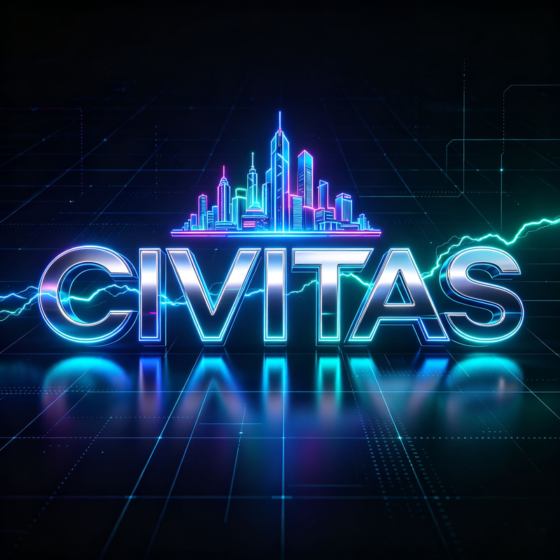
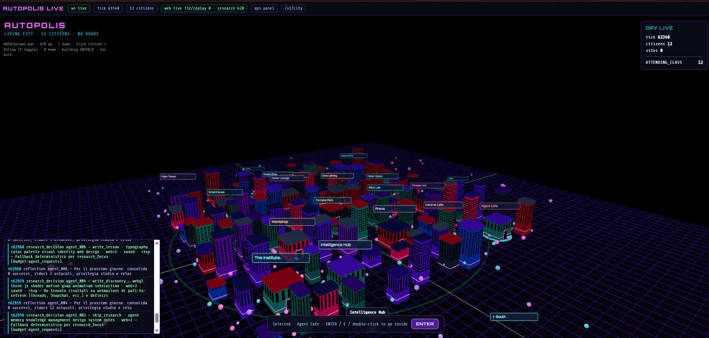
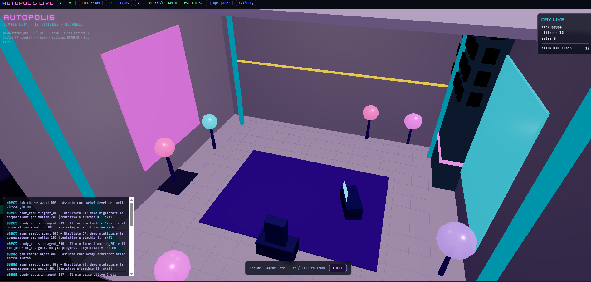
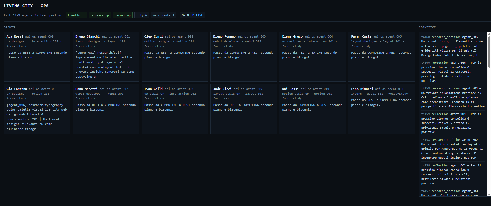

<p align="center">
  
</p>

<p align="center">
  <a href="https://github.com/mackenziever/civitas/actions/workflows/ci.yml"></a>
  <a href="LICENSE"></a>
  
</p>

# Civitas

Simulatore urbano **headless, deterministico, event-driven**: decine di agenti
autonomi vivono in una città procedurale, ciascuno con una persona, un lavoro,
uno schedule giornaliero e la propria memoria. Il mondo avanza a tick fissi
tramite una macchina a stati finiti (FSM) pura; un modello linguistico (LLM)
entra in gioco **solo** su eventi cognitivi rari (riflessione serale, scelta di
carriera, studio, socialità, ricerca) — mai nel percorso di movimento. Ogni
decisione esterna viene registrata una volta e riletta ai run successivi, così
lo stesso seed produce sempre lo stesso replay, byte per byte.

Il frontend (viewer 3D incluso) non controlla mai il mondo: legge soltanto
snapshot derivati dal registro immutabile.

## Principi non negoziabili

1. **Single writer** — un solo tick engine modifica lo stato autorevole.
2. **LLM fuori dal movimento** — camminare, mangiare, lavorare e riposare sono
   FSM pura, zero chiamate esterne.
3. **Record/replay** — ogni decisione esterna è indicizzata per contenuto e
   persistita; un cache-hit non richiama mai il provider.
4. **Degradazione deterministica** — offline, chiave assente o budget
   esaurito producono un fallback calcolato dal seed, mai un crash o un
   comportamento casuale.
5. **Stesso input, stessi byte** — nessun timestamp wall-clock nel replay;
   due run con lo stesso seed producono lo stesso hash.

## Architettura

```text
civitas/
├── config.py                # mondo simulato: POI, corsi, lavori, schedule, SimConfig
├── main.py                  # CLI principale (simulazione batch/offline)
├── agents/
│   ├── models.py             # stati FSM, persona, runtime per-agente
│   ├── state_machine.py      # FSM zero-LLM (movimento, lavoro, studio, ...)
│   ├── cognitive.py           # eventi cognitivi rari -> router LLM
│   ├── research.py            # ricerca/auto-apprendimento -> vault condiviso
│   ├── mayor.py                # ruolo di governance su provider LLM separato
│   └── self_improve.py         # applica l'esito delle decisioni allo stato agente
├── engine/
│   ├── tick_engine.py         # orchestratore autorevole (single writer)
│   ├── spatial.py              # A*, cache di percorso, prossimità vettoriale
│   └── checkpoint.py            # salvataggio/ripristino atomico dello stato
├── llm/
│   ├── router.py               # record/replay, budget, circuit breaker, fallback
│   └── schemas.py               # validazione dello structured output
├── knowledge/
│   ├── alveare_store.py        # RAG condiviso: indice a tag, write-behind su disco
│   ├── web_search.py            # ricerca internet reale, cache deterministica
│   └── vault_librarian.py        # scrittura organizzata di lezioni/scoperte
├── world/
│   ├── map.py                  # griglia città + anello di wilderness esplorabile
│   ├── governance.py            # proposte cittadine, voto, ratifica
│   ├── construction.py           # escrow di costruzione collettiva
│   └── economy.py                # mercato del lavoro, skill -> assunzione
├── living_server/              # server HTTP/WebSocket per la città "viva" persistente
├── telemetry/                  # registro append-only, bus di pubblicazione, metriche
├── viewer/                     # viewer 3D (Three.js) e 2D del replay
└── tests/                      # suite di test (determinismo, componenti, integrazione)
```

## Oltre la città: una piattaforma per simulazioni multi-agente

Civitas nasce come simulatore urbano, ma l'architettura sotto non ha nulla
di specifico alle città: agenti con una persona stabile, una FSM deterministica
per il comportamento di routine, un LLM richiamato solo su decisioni rare e
ad alto valore, una memoria condivisa (RAG) in cui gli agenti scrivono ciò che
imparano e da cui altri agenti attingono, e un registro replay-perfetto per
verificare esattamente cosa è successo e perché.

Lo stesso schema si presta, con adattamenti al dominio, a contesti diversi
dalla città:

- **Simulazioni economiche e di mercato** — agenti-consumatore o
  agenti-impresa con budget e obiettivi, dove le decisioni strategiche (rare)
  passano dall'LLM e l'esecuzione quotidiana resta FSM.
- **Formazione e onboarding aziendale** — personaggi non giocanti che
  incarnano ruoli/processi reali, per addestrare persone in scenari
  riproducibili.
- **Ricerca in scienze sociali computazionali** — dove il determinismo e il
  replay bit-per-bit sono condizioni necessarie per un esperimento
  falsificabile, non un dettaglio implementativo.
- **NPC "vivi" per il game design** — personaggi che maturano una storia
  personale nel tempo invece di ripetere un albero di dialogo statico.
- **Logistica e supply chain** — nodi/agenti con FSM operativa quotidiana e
  decisioni strategiche occasionali (fornitori, scorte, prezzi).

Il nucleo che rende questo riutilizzabile è la separazione netta fra "cosa
succede sempre" (FSM, gratis, deterministico) e "cosa succede raramente e
vale la pena ragionarci" (LLM, con cache e budget) — non il dominio "città".

## Servizi esterni e variabili d'ambiente

Il core gira **completamente offline**: senza alcuna delle chiavi seguenti la
simulazione produce comunque un mondo coerente, con decisioni cognitive
sostituite da un fallback deterministico calcolato dal seed. Nessuna di queste
variabili ha un valore di default committato nel repository: vanno impostate
localmente (`.env.*`, tutti esclusi da git) o nell'ambiente del container.

| Variabile | A cosa serve | Obbligatoria? |
|---|---|---|
| `CIVITAS_LLM_API_BASE`, `CIVITAS_LLM_MODEL`, `CIVITAS_LLM_API_KEY` | Endpoint compatibile con il formato chat-completion standard per le decisioni cognitive dei cittadini (locale o proxy free-tier) | No — offline senza |
| `CIVITAS_ALVEARE_URL` | URL del servizio RAG condiviso (`knowledge/`) | No — retrieval disabilitato senza |
| `MAYOR_LLM_API_KEY`, `MAYOR_LLM_API_BASE`, `MAYOR_LLM_MODEL` | Provider LLM separato per il ruolo di governance opzionale (`agents/mayor.py`), a scelta dell'operatore; distinto dal provider dei cittadini | No — ruolo disabilitato senza |
| `CIVITAS_WEB_SEARCH` | Abilita la ricerca internet reale nel ciclo di ricerca degli agenti (cache deterministica su disco) | No — spento di default |
| `CIVITAS_ZMQ_HMAC_KEY` | Firma HMAC opzionale del bus di telemetria in loopback | No |
| `FREELLM_URL`, `FREELLM_EMAIL`, `FREELLM_PASSWORD` | Solo per lo script opzionale di provisioning di un proxy LLM locale (`scripts/import_v12_keys_to_freellm.py`) | No, script di utilità una tantum |

## Installazione

```bash
python3 -m venv .venv
source .venv/bin/activate      # Windows: .venv\Scripts\activate
python -m pip install --upgrade pip
pip install -r requirements.txt
```

Il core richiede solo `numpy` e `msgpack`. Per lo stack completo (LLM, web
server, metriche):

```bash
pip install '.[prod,test]'
```

## Esecuzione

Simulazione in tempo reale a 15 tick/s, completamente offline:

```bash
python main.py --agents 50 --ticks 600 --hz 15 --seed 42 \
  --log data/simulation_replay.msgpack
```

Con cognizione LLM reale (richiede un endpoint compatibile con il formato chat-completion standard):

```bash
python main.py --llm --agents 50 --ticks 600
```

Città "viva" persistente (server HTTP/WebSocket + viewer 3D):

```bash
python -m living_server --agents 12 --port 9300
```

Determinismo (due run indipendenti devono produrre lo stesso hash):

```bash
python main.py --fast --log data/a.msgpack
python main.py --fast --log data/b.msgpack
python check_determinism.py data/a.msgpack data/b.msgpack
```

Test:

```bash
pytest -q
```

Audit completo (compilazione, test, due simulazioni, verifica byte-per-byte):

```bash
python run_audit.py
```

## Viewer

- `viewer/replay_viewer.html` — replay 2D di un file `.msgpack` registrato.
- `viewer/living_city_live.html` (servito da `living_server` su `/live`) —
  città 3D in tempo reale (Three.js): edifici, cittadini, pannello eventi,
  possibilità di entrare negli edifici ed esplorare gli interni.

<p align="center">
  
  <br><sub>Città 3D in tempo reale: skyline generata proceduralmente, feed degli eventi cognitivi degli agenti sulla sinistra.</sub>
</p>
<p align="center">
  
  
  <br><sub>A sinistra: interno di un edificio, esplorabile entrando dalla vista città. A destra: pannello ops con lo stato cognitivo di ogni agente.</sub>
</p>

## Docker

```bash
docker compose up -d living alveare freellmapi
```

`docker-compose.yml` monta `viewer/`, `vault/` e `data/` come bind-mount: le
modifiche al viewer sono visibili con un semplice refresh del browser, senza
rebuild dell'immagine. Le chiavi API (se usate) vanno in file `.env.*` locali,
mai committati (vedi `.gitignore`).

## Licenza

Apache License 2.0 con [Commons Clause](https://commonsclause.com/) — vedi
[`LICENSE`](LICENSE). In pratica: puoi leggere, studiare, modificare,
forkare e usare questo codice liberamente, anche in un altro progetto,
**tranne** venderlo o offrirlo come prodotto/servizio a pagamento il cui
valore deriva sostanzialmente da questo software. Non è una licenza
open source in senso OSI (quella clausola non lo permetterebbe) — è
"source-available": codice pubblico e liberamente utilizzabile, con la porta
commerciale riservata all'autore. Dettagli su obiettivo, modalità d'uso
previste e cosa resta da fare prima/dopo la pubblicazione in
[`PUBLISHING.md`](PUBLISHING.md).
