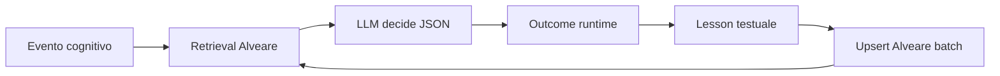

# Self-Learning-Agents — loop outcome → lesson → retrieval

Pattern cognitivo di Civitas: gli agenti **non** fine-tunano pesi.
Imparano scrivendo lezioni testuali e recuperandole via Alveare al tick successivo.

## Ciclo

1. **Outcome** — esito misurabile: exam pass/fail, job change, posture scelta, social stance.
2. **Lesson** — frase strutturata pubblicata in Alveare (`source=agent`, tag evento).
3. **Retrieval** — query Alveare al prossimo evento dello stesso tipo; chunk in context LLM.

Implementazione: `SelfImprovementLoop` + `AgentCognitiveEngine._retrieve_alveare`.

## Memoria: condivisa vs privata

| Tipo | Store | Contenuto |
|------|-------|-----------|
| **Collettiva** | Alveare + vault | skill, wiki, lessons cross-agent |
| **Episodica privata** | `EpisodicMemory` per agente | decisioni locali, non replicata |

Solo le lesson **sanitizzate** (PII strip) entrano in Alveare.

## Hard-case mining (metafora, no PyTorch)

Ispirazione leggera da [lightly-ai/lightly](https://github.com/lightly-ai/lightly) e [facebookresearch/vissl](https://github.com/facebookresearch/vissl):
in quelle codebase si selezionano **campioni difficili** per migliorare il training.

In Civitas l'analogo è **testuale**, non neurale:

- exam **failed** → lesson con ostacolo + corso → retrieval prioritario su query `study`
- collision streak → tag `obstacle` in episodic + lesson reflect
- career reject → lesson con skill gap → altri agenti vedono il pattern

**Nessuna dipendenza torch/vissl/lightly** — solo ranking Alveare + tag + score.

## Eventi e skill

| Evento | Skill vault | Lesson tag |
|--------|-------------|------------|
| `daily_reflection` | [[02-SKILLS/reflect-and-improve]] | `posture`, `self_improve` |
| `career_choice` | [[02-SKILLS/career-ladder]] | `career` |
| `study_focus` | [[02-SKILLS/study-mastery]] | `study` |
| exam | [[02-SKILLS/exam-feedback]] | `exam`, skill unlock |
| `social_stance` | [[02-SKILLS/plaza-social]] | `social` |

## Replay deterministico

Con `CIVITAS_REPLAY=1`: chunk Alveare **frozen** nel trace (`llm_trace.jsonl`).
Il replay non ri-query lo store live — garantisce bit-identical rerun.

## Collegamenti

- [[04-LEARNINGS/README]] · [[06-MEMORY/wiki/freellmapi]] · [[01-AGENTS/collective]]
